# Dynamic Sales ETL Orchestrator 🚀

> **A config‑driven, production‑ready ETL pipeline** that automates sales data processing using **Apache Airflow, PostgreSQL, and Docker**. Built to turn raw CSV sales reports into clean, query‑ready analytics data with intelligent validation, error handling, and business‑friendly feedback.


---

## 📖 Table of Contents

- [The Problem](#-the-problem)
- [The Solution](#-the-solution)
- [Architecture & Workflow](#-architecture--workflow)
- [What You'll Build](#-what-youll-build)
- [Project Structure](#-project-structure)
- [Quick Start](#-quick-start)
- [How It Works (Step-by-Step)](#-how-it-works-step-by-step)
- [Data Model](#-data-model)
- [Demo: Running the Pipeline](#-demo-running-the-pipeline)
- [Key Features](#-key-features)
- [What Makes This Special](#-what-makes-this-special)
- [Next Steps & Extensions](#-next-steps--extensions)

---

## 🎯 The Problem

An online shop owner manually processes daily sales reports:

```
📊 Daily Ritual:
1. Download sales_2025_12_24.csv from the shop website
2. Open in Excel
3. Check for missing values, duplicates, and bad data
4. Manually compute totals (quantity × price)
5. Copy‑paste into a data warehouse
6. Update dashboards manually
⏰ Takes 30 minutes per day, error‑prone, dashboards always stale
```

**This is where automation saves the day.**

---

## ✅ The Solution

A **fully automated, config‑driven ETL orchestrator** that:

- 🔍 **Watches** a folder for new sales CSV files
- ✔️ **Validates** schema, required columns, and data quality thresholds
- 🔄 **Transforms** raw data (compute totals, clean types, remove bad rows)
- 📦 **Loads** clean data into PostgreSQL in seconds
- 📋 **Logs** all failures with audit trails for business review
- 🎨 **Scales** horizontally: add new pipelines via YAML config, no code changes

---

## 🧠 Architecture & Workflow

### High‑Level Data Flow

```mermaid
flowchart LR
    A["📱 Online Shop\n(Orders)"] -->|Export CSV| B["📄 Daily Sales File\n(sales_YYYY_MM_DD.csv)"]
    B -->|Drop into| C["📂 Landing Folder\n(data/landing)"]
    C -->|Trigger| D["🎯 Airflow DAG\n(dynamic_etl_orchestrator)"]
    D -->|Orchestrates| E["⚙️ ETL Pipeline\n(Extract → Validate → Transform → Load)"]
    E -->|Upsert clean data| F["💾 PostgreSQL\n(sales table)"]
    E -->|Log errors| G["🚨 PostgreSQL\n(failed_loads table)"]
    F -->|Power| H["📊 BI Dashboards\n(Metabase, Superset, Tableau)"]
    H -->|Insights| I["🎯 Business User\n(Reports & Analytics)"]
    
    style A fill:#e1f5ff
    style B fill:#fff9c4
    style C fill:#f3e5f5
    style D fill:#e8f5e9
    style E fill:#fce4ec
    style F fill:#e0f2f1
    style G fill:#ffebee
    style H fill:#f1f8e9
    style I fill:#fff3e0
```



### The 7‑Step Workflow (Animated)

```mermaid
sequenceDiagram
    participant Shop as 🏪 Online Shop
    participant File as 📄 CSV File
    participant Landing as 📂 Landing Folder
    participant Airflow as 🎯 Airflow Scheduler
    participant Extract as 📥 Extract Module
    participant Validate as ✔️ Validate Module
    participant Transform as 🔄 Transform Module
    participant Load as 📦 Load Module
    participant DB as 💾 PostgreSQL

    Shop->>File: Generate sales_2025_12_24.csv
    File->>Landing: New file arrives (cron monitored)
    Landing->>Airflow: DAG trigger detected
    
    Airflow->>Extract: Step 1: Extract CSV
    Extract->>Extract: Read into pandas DataFrame
    Extract-->>Airflow: ✅ 100 rows extracted

    Airflow->>Validate: Step 2: Validate schema
    Validate->>Validate: Check columns: order_id, product, quantity, price
    Validate->>Validate: Check null rate < 5%
    
    alt Data is valid
        Validate-->>Airflow: ✅ Validation passed
        Airflow->>Transform: Step 3: Transform data
        Transform->>Transform: Cast quantity, price to numeric
        Transform->>Transform: Compute total_amount = qty × price
        Transform->>Transform: Filter bad rows
        Transform-->>Airflow: ✅ 98 clean rows ready

        Airflow->>Load: Step 4: Load into database
        Load->>DB: INSERT INTO sales (...)
        Load->>DB: COMMIT transaction
        Load-->>Airflow: ✅ 98 rows loaded
        
        Airflow-->>Shop: 🟢 SUCCESS: Fresh sales data ready!
    else Data is invalid
        Validate->>DB: Log error into failed_loads
        Validate-->>Airflow: ❌ Validation failed: missing column 'price'
        Airflow-->>Shop: 🔴 ERROR: Fix file & re‑upload
    end
```



**Key insight**: Each step is logged clearly so business users know exactly what happened.

---

## 🧩 What You'll Build

### 1️⃣ Config‑Driven Pipeline Definitions

Edit `configs/pipelines.yaml` to define pipelines **without touching code**:

```yaml
pipelines:
  daily_sales:
    description: "Process daily sales reports from shop website"
    file_pattern: "sales_*.csv"
    required_columns:
      - order_id
      - order_date
      - customer
      - product
      - quantity
      - price
    null_threshold: 0.05  # Max 5% nulls allowed
    target_table: "sales"
    error_folder: "data/bad"
    landing_folder: "data/landing"
    processed_folder: "data/processed"
```

**To add a new pipeline** (e.g., returns, inventory, shipments): just add another block. No DAG code needed.

### 2️⃣ Intelligent ETL Modules

**`src/extract.py`**: Read CSV from landing folder
```python
def extract_csv(file_path: str) -> pd.DataFrame:
    """Load CSV into DataFrame, handle encoding & delimiters"""
    return pd.read_csv(file_path)
```

**`src/validation.py`**: Enforce data quality rules
```python
def validate_schema(df: pd.DataFrame, config: dict) -> tuple[bool, str]:
    """Check required columns and null thresholds"""
    # ✔️ Validates required_columns
    # ✔️ Validates null_threshold
    # ✔️ Returns clear error messages for business users
```

**`src/transform.py`**: Clean and enrich data
```python
def transform_data(df: pd.DataFrame) -> pd.DataFrame:
    """Type cast, compute derived fields, remove bad rows"""
    df['quantity'] = pd.to_numeric(df['quantity'], errors='coerce')
    df['price'] = pd.to_numeric(df['price'], errors='coerce')
    df['total_amount'] = df['quantity'] * df['price']
    return df.dropna()
```

**`src/load.py`**: Persist to PostgreSQL
```python
def load_to_postgres(df: pd.DataFrame, connection, table: str):
    """Insert clean rows, log failures into audit table"""
    df.to_sql(table, connection, if_exists='append', index=False)
    # 📋 Failures logged to failed_loads for audit trail
```

### 3️⃣ Dynamic Airflow Orchestrator

**`dags/dynamic_etl_orchestrator_dag.py`** reads config and creates tasks on‑the‑fly:

```python
# At DAG parse time, for each pipeline in pipelines.yaml:
for pipeline_name, config in pipelines.items():
    task = PythonOperator(
        task_id=f"run_pipeline__{pipeline_name}",
        python_callable=run_etl_pipeline,
        op_kwargs={"config": config}
    )
    # ✨ Single DAG, unlimited pipelines
```

**Why this matters**: Add 10 new pipelines without writing a single line of Airflow DAG code.

### 4️⃣ Dockerized, Production‑Ready Stack

```yaml
# docker-compose.yml
services:
  postgres:
    image: postgres:13
    environment:
      POSTGRES_DB: airflow_db
      POSTGRES_PASSWORD: airflow

  airflow-webserver:
    image: apache/airflow:2.7.0
    ports:
      - "8080:8080"

  airflow-scheduler:
    image: apache/airflow:2.7.0
```

Everything runs in containers → reproducible, scalable, cloud‑ready.

---

## 📂 Project Structure

```
dynamic-sales-etl-orchestrator/
│
├── dags/
│   └── dynamic_etl_orchestrator_dag.py      # ✨ Single orchestrator DAG
│
├── src/
│   ├── __init__.py
│   ├── extract.py                           # Read CSV
│   ├── validation.py                        # Validate schema & quality
│   ├── transform.py                         # Clean & enrich data
│   └── load.py                              # Insert into Postgres
│
├── configs/
│   └── pipelines.yaml                       # 🎨 Config for all pipelines
│
├── data/
│   ├── landing/                             # Incoming CSVs go here
│   ├── processed/                           # Move here after success
│   └── bad/                                 # Move here if invalid
│
├── init/
│   └── init_db.sql                          # Create tables on startup
│
├── docker-compose.yml                       # 🐳 Full stack in one file
├── requirements.txt                         # Python dependencies
├── .gitignore
└── README.md                                # You are here! 👋
```

This structure follows **data engineering best practices** and scales from a prototype to a production pipeline.

---

## 🚀 Quick Start

### Prerequisites

- **Docker & Docker Compose** installed ([Install here](https://docs.docker.com/get-docker/))
- **Git** installed
- 4GB RAM free (minimum)

### Step 1: Clone the Repository

```bash
git clone https://github.com/<your-username>/dynamic-sales-etl-orchestrator.git
cd dynamic-sales-etl-orchestrator
```

### Step 2: Start the Stack

```bash
docker-compose up -d
```

Wait 30–60 seconds for services to initialize:
- Postgres container starts and initializes the database
- Airflow scheduler & webserver start and register the DAG

### Step 3: Verify Services Are Running

```bash
docker-compose ps
```

You should see:
```
NAME                           STATUS
postgres                       Up 30 seconds
airflow-webserver              Up 30 seconds (port 8080)
airflow-scheduler              Up 30 seconds
airflow-flower                 Up 30 seconds (port 5555)
```

### Step 4: Access Airflow UI

- **URL**: `http://localhost:8080`
- **Username**: `airflow`
- **Password**: `airflow`

### Step 5: Create Sample Sales Data

Create a file `data/landing/sales_2025_12_24.csv`:

```csv
order_id,order_date,customer,product,quantity,price
1,2025-12-24,Alice Johnson,Mechanical Keyboard,2,1500
2,2025-12-24,Bob Smith,Wireless Mouse,1,800
3,2025-12-24,Carol White,USB-C Cable,5,200
4,2025-12-24,David Lee,Monitor 27",1,15000
5,2025-12-24,Eve Martinez,Laptop Stand,3,1200
```

### Step 6: Trigger the DAG

1. In Airflow UI → **DAGs** section
2. Find `dynamic_etl_orchestrator` → click **ON** toggle
3. Click **Trigger DAG** button
4. Switch to **Graph** view to watch the pipeline execute

### Step 7: View the Results

Query the database:

```bash
docker-compose exec postgres psql -U airflow -d airflow_db -c \
  "SELECT order_id, customer, product, quantity, price, total_amount FROM sales ORDER BY order_id;"
```

Expected output:
```
 order_id |    customer    |        product        | quantity | price | total_amount
----------+----------------+-----------------------+----------+-------+--------------
        1 | Alice Johnson  | Mechanical Keyboard   |        2 |  1500 |         3000
        2 | Bob Smith      | Wireless Mouse        |        1 |   800 |          800
        3 | Carol White    | USB-C Cable           |        5 |   200 |         1000
        4 | David Lee      | Monitor 27"           |        1 | 15000 |        15000
        5 | Eve Martinez   | Laptop Stand          |        3 |  1200 |         3600
(5 rows)
```

✅ **Success!** Your ETL pipeline works end‑to‑end.

---

## 🎬 How It Works (Step-by-Step)

### Step 1️⃣: File Arrives in Landing Folder

```
📂 data/landing/
  └── sales_2025_12_24.csv (100 rows, 6 columns)
```

The Airflow scheduler detects the DAG is due and creates a task instance.

### Step 2️⃣: Extract

**`src/extract.py`** reads the CSV:

```python
df = pd.read_csv("data/landing/sales_2025_12_24.csv")
print(f"Extracted {len(df)} rows")
# Output: "Extracted 100 rows"
```

**Airflow logs:**
```
[2025-12-24 12:34:56] Step 1: Extract CSV
[2025-12-24 12:34:57] Found file: sales_2025_12_24.csv
[2025-12-24 12:34:57] Extracted 100 rows from CSV
```

### Step 3️⃣: Validate

**`src/validation.py`** enforces rules from config:

```python
def validate_schema(df, config):
    # Check 1: Required columns
    required = config['required_columns']  # ['order_id', 'product', 'quantity', 'price']
    missing = set(required) - set(df.columns)
    if missing:
        raise ValueError(f"Missing columns: {missing}")
    
    # Check 2: Null threshold
    null_rate = df.isnull().sum().sum() / df.size
    if null_rate > config['null_threshold']:  # 0.05 = 5%
        raise ValueError(f"Null rate {null_rate:.1%} exceeds threshold {config['null_threshold']:.1%}")
    
    return True
```

**Airflow logs:**
```
[2025-12-24 12:34:58] Step 2: Validate schema
[2025-12-24 12:34:58] Required columns: ['order_id', 'product', 'quantity', 'price'] ✓
[2025-12-24 12:34:58] Null rate: 0.2% ✓ (threshold: 5%)
[2025-12-24 12:34:58] Validation: PASSED
```

### Step 4️⃣: Transform

**`src/transform.py`** enriches the data:

```python
def transform_data(df):
    # Type casting
    df['quantity'] = pd.to_numeric(df['quantity'], errors='coerce')
    df['price'] = pd.to_numeric(df['price'], errors='coerce')
    
    # Compute derived field
    df['total_amount'] = df['quantity'] * df['price']
    
    # Remove rows with NULL in critical columns
    df = df.dropna(subset=['quantity', 'price', 'total_amount'])
    
    return df
```

**Airflow logs:**
```
[2025-12-24 12:34:59] Step 3: Transform data
[2025-12-24 12:34:59] Cast quantity, price to numeric
[2025-12-24 12:35:00] Computed total_amount = quantity × price
[2025-12-24 12:35:00] Dropped 2 rows with NULL values
[2025-12-24 12:35:00] Transformation complete: 98 rows ready
```

### Step 5️⃣: Load

**`src/load.py`** inserts into PostgreSQL:

```python
def load_to_postgres(df, connection, table_name):
    rows_before = connection.execute(f"SELECT COUNT(*) FROM {table_name}").scalar()
    df.to_sql(table_name, connection, if_exists='append', index=False)
    rows_after = connection.execute(f"SELECT COUNT(*) FROM {table_name}").scalar()
    
    return rows_after - rows_before
```

**Airflow logs:**
```
[2025-12-24 12:35:01] Step 4: Load into PostgreSQL
[2025-12-24 12:35:01] Connecting to airflow_db...
[2025-12-24 12:35:02] INSERT INTO sales (order_id, customer, product, quantity, price, total_amount)
[2025-12-24 12:35:02] Successfully loaded 98 rows
[2025-12-24 12:35:03] Rows now in sales table: 542 (was 444)
```

### Step 6️⃣: Success or Failure?

**Success path** (data valid):
```
✅ Airflow Task: GREEN
📊 Data ready for dashboards
📂 File moved to data/processed/
```

**Failure path** (data invalid):
```
❌ Airflow Task: RED
📋 Error logged into failed_loads table
📂 File moved to data/bad/
🔔 Business user notified to review & fix
```

### Step 7️⃣: Audit Trail

**`failed_loads` table** captures all errors for compliance & debugging:

```sql
SELECT id, pipeline_name, filename, error_type, error_message, created_at
FROM failed_loads
WHERE created_at >= NOW() - INTERVAL '7 days'
ORDER BY created_at DESC;
```

Result:
```
 id | pipeline_name | filename              | error_type    | error_message                    | created_at
----+---------------+-----------------------+---------------+----------------------------------+------------------
  1 | daily_sales   | sales_bad_2025_12_23  | MissingColumn | Missing columns: ['price']       | 2025-12-23 15:30
  2 | daily_sales   | sales_error_2025_12_22| NullThreshold | Null rate 8.5% exceeds 5%       | 2025-12-22 14:15
```

**Business users can:**
- Review errors without technical jargon
- See exactly which files failed and why
- Prepare fixes for re‑upload

---

## 📊 Data Model

### `sales` Table

| Column       | Type      | Purpose                           | Example      |
|--------------|-----------|-----------------------------------|--------------|
| `order_id`   | INTEGER   | Unique order identifier           | 1, 2, 3      |
| `order_date` | DATE      | Order placement date              | 2025-12-24   |
| `customer`   | VARCHAR   | Customer name                     | Alice Johnson|
| `product`    | VARCHAR   | Product purchased                 | Keyboard     |
| `quantity`   | INTEGER   | Units ordered                     | 2, 1, 5      |
| `price`      | DECIMAL   | Unit price                        | 1500, 800    |
| `total_amount`| DECIMAL  | **Computed**: quantity × price    | 3000, 800    |

**SQL to create**:
```sql
CREATE TABLE sales (
    id SERIAL PRIMARY KEY,
    order_id INTEGER UNIQUE NOT NULL,
    order_date DATE,
    customer VARCHAR(255),
    product VARCHAR(255),
    quantity INTEGER,
    price DECIMAL(10,2),
    total_amount DECIMAL(12,2),
    created_at TIMESTAMP DEFAULT CURRENT_TIMESTAMP
);
```

### `failed_loads` Table

| Column           | Type      | Purpose                                  |
|------------------|-----------|------------------------------------------|
| `id`             | SERIAL    | Unique audit record ID                   |
| `pipeline_name`  | VARCHAR   | Which pipeline failed (e.g., daily_sales)|
| `filename`       | VARCHAR   | The file that failed                     |
| `error_type`     | VARCHAR   | Category (MissingColumn, NullThreshold)  |
| `error_message`  | TEXT      | Human‑readable error description         |
| `created_at`     | TIMESTAMP | When the error occurred                  |

**SQL to create**:
```sql
CREATE TABLE failed_loads (
    id SERIAL PRIMARY KEY,
    pipeline_name VARCHAR(255),
    filename VARCHAR(255),
    error_type VARCHAR(100),
    error_message TEXT,
    created_at TIMESTAMP DEFAULT CURRENT_TIMESTAMP
);
```

---

## 🎥 Demo: Running the Pipeline

### Scenario: Fresh Sales Report Arrives

**Time: 9:00 AM**  
Shop owner exports yesterday's sales as `sales_2025_12_24.csv` (98 valid orders, 2 with missing price).

**Time: 9:05 AM**  
You upload the file to `data/landing/`.

**Time: 9:05:30 AM**  
Airflow scheduler detects the DAG is ready and creates a task instance.

**Time: 9:05:45 AM**  
The `run_pipeline__daily_sales` task starts:

```
⏱️  09:05:45 [Stage 1] Extract CSV
    └─ Found: sales_2025_12_24.csv (100 rows)
    └─ Result: ✅ Extracted

⏱️  09:05:46 [Stage 2] Validate Schema
    └─ Required columns: order_id, order_date, customer, product, quantity, price
    └─ Null rate: 2.0% (threshold: 5.0%)
    └─ Result: ✅ Passed

⏱️  09:05:47 [Stage 3] Transform Data
    └─ Cast quantity, price to numeric
    └─ Compute total_amount = quantity × price
    └─ Drop 2 rows with NULL price
    └─ Result: ✅ 98 clean rows ready

⏱️  09:05:48 [Stage 4] Load into PostgreSQL
    └─ INSERT INTO sales (order_id, customer, product, quantity, price, total_amount)
    └─ Rows affected: 98
    └─ Result: ✅ Loaded

⏱️  09:05:50 [Summary]
    ├─ Status: ✅ SUCCESS
    ├─ Total rows: 98
    ├─ Processed in: 5 seconds
    └─ Data ready for dashboards!
```

**Time: 9:06:00 AM**  
Airflow UI shows task as GREEN ✅

**Time: 9:06:30 AM**  
Dashboard refreshes and shows today's sales orders with fresh data.

---

## ⭐ Key Features

### 1. Config‑Driven, Not Code‑Driven

Add a new pipeline (e.g., `returns`, `shipments`, `inventory`) in **YAML only**:

```yaml
pipelines:
  returns:
    description: "Process return requests"
    file_pattern: "returns_*.csv"
    required_columns: [return_id, order_id, reason, refund_amount]
    null_threshold: 0.02
    target_table: "returns"
```

**No Airflow DAG code needed.** The orchestrator auto‑creates the task.

### 2. Intelligent Validation

- **Schema checking**: Required columns, data types
- **Quality rules**: Null thresholds, duplicate detection
- **Business rules**: Date ranges, numeric bounds
- **Clear error messages**: For both developers and business users

### 3. Graceful Error Handling

- Invalid files → moved to `data/bad/` (not deleted)
- Errors → logged with timestamps and root causes
- Retries supported: fix and re‑upload, pipeline auto‑restarts
- Audit trail: every failure is recorded for compliance

### 4. Fully Dockerized

- One command: `docker-compose up -d` → entire stack running
- Reproducible locally, in CI/CD, in production
- No dependency hell, no "works on my machine"
- Easy to deploy to cloud (AWS ECS, Google Cloud Run, etc.)

### 5. Airflow Integration

- Scheduled runs (e.g., daily at 9 AM)
- Manual triggers from the UI
- Rich logging and task monitoring
- Dependencies between pipelines (if needed later)

### 6. Production‑Ready

- ✅ Error handling & retries
- ✅ Logging with timestamps
- ✅ Audit trails
- ✅ Type hints for code clarity
- ✅ Modular, testable code

---

## 🌟 What Makes This Special

### 1. Real‑World Business Problem

Not a toy example. This solves an actual pain point:
- Real shops with real sales data
- Real validation challenges
- Real error recovery workflows

### 2. Enterprise Patterns

- **Config‑driven design**: Scales to 100+ pipelines without touching code
- **Separation of concerns**: Extract, validate, transform, load are separate modules
- **Audit & compliance**: Every action logged with timestamps and reasons

### 3. Portfolio Gold

Demonstrates skills that matter in data engineering roles:

| Skill                    | Demonstrated By                              |
|--------------------------|----------------------------------------------|
| Orchestration            | Apache Airflow DAG design                    |
| Data pipeline design     | Extract → Validate → Transform → Load flow   |
| Cloud & containerization | Docker Compose stack                         |
| Database design          | PostgreSQL schema, indexes                   |
| Error handling           | Try‑except, logging, audit trails            |
| Configuration management | YAML‑driven pipeline definitions             |
| Python data tools        | Pandas, SQLAlchemy, PyYAML                  |
| Version control          | Git workflow ready                           |

### 4. Extensible

Add features without rewriting:
- New data quality checks
- Alerting on failures
- Data lineage & schema registry
- Incremental loading (CDC patterns)
- Multi‑source joins

---

## 🔧 Configuration Guide

### Define a New Pipeline

Edit `configs/pipelines.yaml`:

```yaml
pipelines:
  my_new_pipeline:
    description: "What this pipeline does"
    file_pattern: "my_files_*.csv"          # Regex pattern for input files
    required_columns:                        # Columns that must exist
      - column1
      - column2
    null_threshold: 0.05                     # Max null fraction (0.05 = 5%)
    target_table: "my_table"                 # Where to insert clean data
    error_folder: "data/bad"                 # Where to move invalid files
    landing_folder: "data/landing"           # Source folder
    processed_folder: "data/processed"       # Where to move after success
```

### Customize ETL Logic

**Modify `src/transform.py`** for pipeline‑specific transformations:

```python
def transform_data(df: pd.DataFrame, pipeline_name: str) -> pd.DataFrame:
    """Custom transformations per pipeline"""
    
    if pipeline_name == "daily_sales":
        # Sales‑specific: compute total_amount
        df['total_amount'] = df['quantity'] * df['price']
    
    elif pipeline_name == "returns":
        # Returns‑specific: categorize return reasons
        df['reason_category'] = df['reason'].map({
            'damaged': 'product_issue',
            'wrong_item': 'fulfillment_error',
            'changed_mind': 'customer_choice'
        })
    
    return df.dropna()
```

### Add Postgres Indices (Performance)

Connect to the database and run:

```sql
CREATE INDEX idx_sales_order_date ON sales(order_date);
CREATE INDEX idx_sales_customer ON sales(customer);
CREATE INDEX idx_failed_loads_created_at ON failed_loads(created_at DESC);
```

---

## 🚨 Troubleshooting

### Airflow UI not loading

```bash
# Check logs
docker-compose logs airflow-webserver | tail -50

# Restart services
docker-compose restart
```

### Postgres connection error

```bash
# Check if postgres is running
docker-compose logs postgres

# Verify connection from airflow container
docker-compose exec airflow-webserver psql -U airflow -h postgres -d airflow_db -c "SELECT 1;"
```

### File not being processed

```bash
# Check file is in correct location
ls -la data/landing/

# Verify file naming matches pipelines.yaml pattern
cat configs/pipelines.yaml | grep file_pattern

# Manually trigger DAG
docker-compose exec airflow-scheduler airflow dags test dynamic_etl_orchestrator 2025-12-24
```

### Check failed loads

```sql
SELECT * FROM failed_loads
WHERE created_at >= NOW() - INTERVAL '24 hours'
ORDER BY created_at DESC;
```

---

## 📈 Next Steps & Extensions

### Phase 2: Add BI Dashboard

```bash
docker-compose up metabase  # or superset
# Connect to airflow_db
# Create dashboard on sales table
```

### Phase 3: Data Quality Checks

Add to `validation.py`:

```python
# Duplicate detection
duplicates = df[df.duplicated(subset=['order_id'], keep=False)]

# Outlier detection
def detect_outliers(df):
    Q1 = df['price'].quantile(0.25)
    Q3 = df['price'].quantile(0.75)
    IQR = Q3 - Q1
    return df[(df['price'] < Q1 - 1.5*IQR) | (df['price'] > Q3 + 1.5*IQR)]
```

### Phase 4: Alerting

Add to Airflow:

```python
from airflow.operators.email import EmailOperator

email_on_failure = EmailOperator(
    task_id='email_on_failure',
    to='shop_owner@example.com',
    subject='Sales pipeline failed',
    html_content='Check failed_loads table for details'
)

run_pipeline >> email_on_failure  # If pipeline fails
```

### Phase 5: Multi‑Source Joins

Load from multiple sources:

```yaml
pipelines:
  enriched_sales:
    sources:
      - table: sales
      - table: customer_profiles
      - table: product_catalog
    join_key: customer_id
    target_table: sales_enriched
```

### Phase 6: Incremental Loading

Instead of full load, update only changed rows (CDC):

```python
def load_incremental(df, connection, table, key_column):
    """INSERT new, UPDATE existing"""
    # Merge logic using key_column
```

### Phase 7: Data Lineage

Track where each row came from:

```python
df['source_file'] = filename
df['processed_at'] = datetime.now()
df['pipeline_run_id'] = run_id  # From Airflow context
```

---

## 📝 License

MIT License — feel free to use, modify, and share.

---

## 🤝 Contributing

Found a bug? Have a feature idea?

1. Create an issue describing the problem/idea
2. Fork the repository
3. Create a feature branch: `git checkout -b feature/your-feature`
4. Commit changes: `git commit -m 'Add your feature'`
5. Push: `git push origin feature/your-feature`
6. Open a Pull Request

---

## 📞 Support

- **Documentation**: See this README
- **Issues**: Check GitHub Issues
- **Airflow Docs**: https://airflow.apache.org/docs/
- **Postgres Docs**: https://www.postgresql.org/docs/

---

## 🎓 Learning Resources

| Topic | Resource |
|-------|----------|
| Apache Airflow | [Official Airflow Tutorial](https://airflow.apache.org/docs/apache-airflow/stable/tutorial.html) |
| PostgreSQL | [PostgreSQL Manual](https://www.postgresql.org/docs/) |
| Docker | [Docker Compose Docs](https://docs.docker.com/compose/) |
| Pandas | [Pandas Documentation](https://pandas.pydata.org/docs/) |
| ETL Best Practices | [Data Engineering Weekly](https://www.dataengineeringweekly.com/) |

---

## 🌟 Acknowledgments

Built with:
- **Apache Airflow** — Orchestration
- **PostgreSQL** — Data warehouse
- **Docker** — Containerization
- **Pandas** — Data transformation
- **Python** — Core language

---

**Happy data engineering! 🚀**

*Last updated: December 24, 2025*
